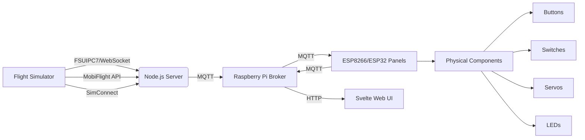

# DIY Home Cockpit for Flight Simulators 🛩️

[](https://opensource.org/licenses/MIT)  
[](https://www.protondb.com)  
[](https://windows.com)  
**🚧 WARNING: PROJECT IN ACTIVE DEVELOPMENT - NOT FLIGHT-READY YET 🚧**  
*Born: July 2025 - Currently in early alpha stage*

## The Genesis: Why This Project Exists  

As a Linux gamer running Microsoft Flight Simulator through Proton, I faced constant frustrations:  
- **Driver hell**: Proprietary drivers and DLL dependencies breaking under Wine/Proton  
- **Cable chaos**: USB spaghetti limiting cockpit flexibility  
- **Windows lock-in**: Vendor tools requiring Windows for configuration  
- **Addon incompatibility**: Tricky hardware solutions failing on Linux  

**This project solves these problems by:**  
1. Replacing wired connections with Wi-Fi communication  
2. Eliminating OS-specific drivers through open standards  
3. Creating a modular system that works equally well on **Linux AND Windows**  
4. Ensuring compatibility with emerging network-based flight sim interfaces  

## Technical Highlights ⚡  



### Hardware Requirements  
- **Central Hub**:  
  - Raspberry Pi 3B+ or newer  
  - Other compatible SBCs: Orange Pi, Banana Pi, etc.  
- **Control Modules**:  
  - ESP8266 (NodeMCU, Wemos D1 Mini)  
  - ESP32 (recommended for advanced features)  
- **Network**: Dedicated 2.4GHz Wi-Fi router recommended  

## Roadmap 🗺️  

| Timeline     | Features                          |
|--------------|-----------------------------------|
| Q3 2025      | ✅ Core architecture              |
|              | ✅ Basic button/switch support    |
| Q4 2025      | 🚧 Analog instrument support      |
|              | 🚧 Web UI framework               |
| Q1 2026      | 🚧 SimConnect bridge module       |
|              | 🚧 Failure simulation engine      |
| Q2 2026      | 🔜 OLED display modules           |
|              | 🔜 Force feedback support         |
|              | 🔜 VR integration layer           |

## Key Features  

- **Universal Hardware Support**:  
  - ESP8266 for basic I/O (buttons, LEDs)  
  - ESP32 for advanced components (displays, encoders)  
  - Automatic detection of connected modules  

- **Cross-Simulator Compatibility**:  
  - Works with MSFS, X-Plane, DCS World  
  - Adapter layer for FSUIPC7, MobiFlight, SimConnect  

- **Optimized Architecture**:  
  - Centralized processing on Raspberry Pi  
  - Distributed I/O handling on ESP modules  
  - Lightweight Alpine Linux base system  

## Getting Started  

```bash
# On Raspberry Pi
git clone https://github.com/your-repo/home-cockpit.git
cd home-cockpit
./setup-alpine.sh  # Configures lightweight environment

# For ESP8266 modules
flash firmware/esp8266-firmware.bin
```

## Contribute to the Project!  

We're looking for:  
- Hardware testers (ESP8266/ESP32 platforms)  
- SimConnect experts  
- UI/UX designers for the web interface  

**License**: MIT - See [LICENSE.md](LICENSE.md) for details.  

---

**Build your dream cockpit - wireless and platform-agnostic!** ✈️💻🔧  

> **Note**: Project currently in active development - suitable for tinkerers and early adopters. Production-ready version expected Q2 2026.
